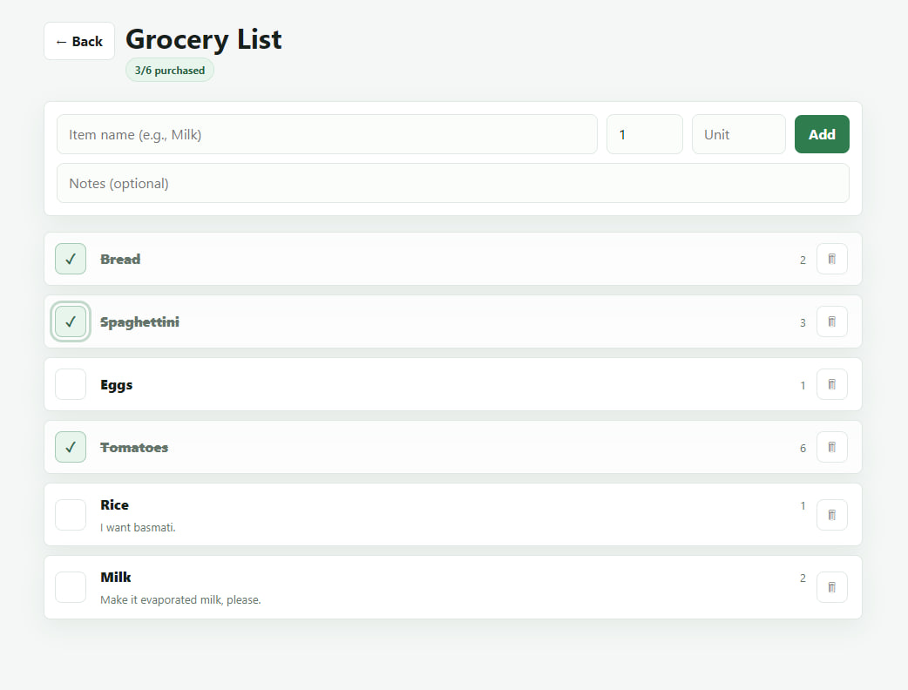
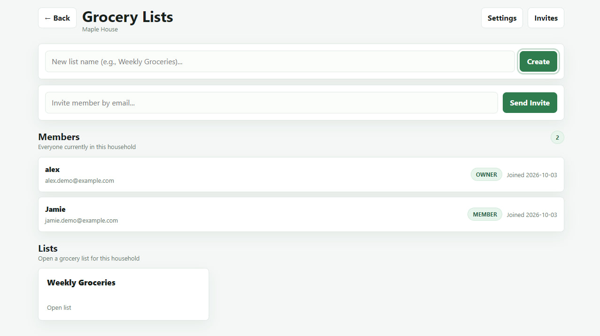
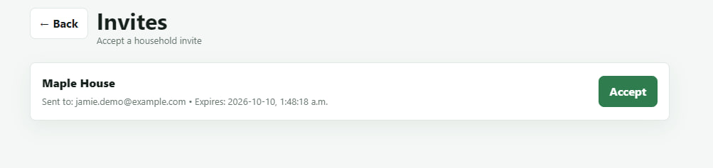
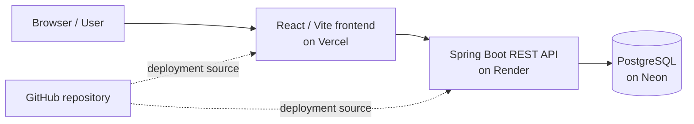

# Grocery App

Grocery App is a full-stack household grocery list application for creating shared grocery spaces, inviting household members, and tracking what still needs to be bought. It combines a React/Vite frontend with a Spring Boot REST API backed by PostgreSQL.

## Live Demo

**[Try Grocery App](https://grocery-app-ivory-rho.vercel.app/)**

The frontend is deployed on Vercel, the Spring Boot backend is deployed on Render, and PostgreSQL is hosted on Neon.

## Main Preview



## Key Features

- Email/password signup and login with JWT authentication
- BCrypt password hashing through Spring Security
- Forgot-password and reset-password flow with hashed reset tokens and 45-minute expiry
- Production-safe password reset configuration: local console delivery, disabled mode for production, and optional Resend delivery when configured
- User profile page for viewing email and updating display name
- Household creation with owner/member roles and active membership checks
- Household member list for active members
- Owner-only household invites by email with expiring invite tokens
- Pending invite view and invite acceptance for the invited email address
- Shared grocery lists scoped to a household
- Grocery list items with quantity, unit, notes, purchased status, purchaser tracking, and soft delete
- Household settings for owner rename, non-owner leave, and sole-owner household close
- Responsive React UI styled with plain CSS

## Application Preview



Household overview with the current members, invite form, and grocery lists for a selected household.



Pending household invites can be reviewed and accepted from the invites page.

## Tech Stack

### Frontend

- React 19
- Vite 7
- React Router 7
- Axios
- Plain CSS

### Backend

- Java 21
- Spring Boot 3.5
- Spring Web
- Spring Security
- Spring Data JPA / Hibernate
- Jakarta Bean Validation
- PostgreSQL JDBC driver
- JJWT
- Lombok
- Maven Wrapper
- Docker multi-stage backend build

### Database and Hosting Targets

- PostgreSQL, with Neon recommended for hosted production database
- Vercel recommended for the static React frontend
- Render recommended for the Spring Boot backend container/service
- GitHub as the source repository and deployment source

## Architecture



The frontend stores the JWT in `localStorage` and sends it on API requests through an Axios interceptor. The backend is stateless, validates JWTs with a Spring Security filter, and protects all non-auth API routes. Household, invite, grocery-list, list-item, profile, and password-reset operations are implemented as REST endpoints under `/api`.

## Security / Engineering Practices

- Passwords are hashed with `BCryptPasswordEncoder`; raw passwords are not stored.
- JWT signing uses an environment-driven secret, and placeholder JWT secrets are rejected in production.
- CORS allowed origins are configurable through environment variables.
- SQL logging is environment-driven and disabled by default in committed config.
- Hibernate `ddl-auto` is environment-driven and defaults to `validate` in committed config.
- Real `.env` files are ignored; `.env.example` files contain placeholders only.
- Password reset requests avoid account enumeration by using safe responses.
- Reset tokens are generated with secure randomness, stored as SHA-256 hashes, expire after 45 minutes by default, and are marked used after reset.
- Console password reset links are available for local/dev mode only and are blocked in production.
- `PASSWORD_RESET_DELIVERY_MODE=disabled` allows production deployments without generating or storing reset tokens.
- Resend email delivery exists behind `PASSWORD_RESET_DELIVERY_MODE=resend`, but it requires provider env vars and a verified sender/domain before use.
- The backend Dockerfile builds with Maven Wrapper and runs as a non-root user in a lightweight JRE image.

## Running Locally

### Prerequisites

- Java 21
- Node.js and npm
- PostgreSQL
- Git

### 1. Clone the repository

```bash
git clone https://github.com/Folariin/grocery-app.git
cd grocery-app
```

### 2. Configure PostgreSQL

Create a local database, for example:

```sql
CREATE DATABASE grocerydb;
```

### 3. Configure the backend

```bash
cd backend/backend
cp .env.example .env
```

Spring Boot does not automatically load `.env` files by itself. Use the values from `backend/backend/.env.example` in your shell, IDE run configuration, or hosting environment.

For a first local run against an empty database, use:

```bash
export APP_ENV=local
export APP_CORS_ALLOWED_ORIGINS=http://localhost:5173
export SPRING_DATASOURCE_URL=jdbc:postgresql://localhost:5432/grocerydb
export SPRING_DATASOURCE_USERNAME=postgres
export SPRING_DATASOURCE_PASSWORD=your_local_password
export SPRING_JPA_HIBERNATE_DDL_AUTO=update
export JWT_SECRET=CHANGE_ME_TO_A_LONG_RANDOM_32_PLUS_CHARACTER_SECRET
export PASSWORD_RESET_DELIVERY_MODE=console
export PASSWORD_RESET_FRONTEND_URL=http://localhost:5173/reset-password
```

On Windows PowerShell, set variables with `$env:VARIABLE_NAME="value"` before starting the backend.

Run the API from `backend/backend`:

```bash
./mvnw spring-boot:run
```

On Windows PowerShell:

```powershell
.\mvnw spring-boot:run
```

The backend runs on `http://localhost:8080` by default.

### 4. Configure and run the frontend

From the repository root:

```bash
cd grocery-frontend
cp .env.example .env
npm install
npm run dev
```

The frontend dev server runs on the Vite local URL, usually `http://localhost:5173`. Local development falls back to `http://localhost:8080` if `VITE_API_BASE_URL` is omitted, but production builds require it.

### 5. Build checks

Backend:

```bash
cd backend/backend
./mvnw clean package -DskipTests
```

Frontend:

```bash
cd grocery-frontend
npm run build
```

## Repository Structure

```text
.
├── README.md
├── docs/
│   └── screenshots/
│       ├── grocery-list.jpg
│       ├── household-overview.jpg
│       └── household-invite.jpg
├── backend/
│   ├── README.md
│   └── backend/                 # Spring Boot API
│       ├── Dockerfile
│       ├── .env.example
│       ├── pom.xml
│       └── src/
└── grocery-frontend/            # React/Vite frontend
    ├── .env.example
    ├── package.json
    └── src/
```

The backend intentionally lives at `backend/backend`; the current setup commands and Dockerfile assume that structure.

## Deployment

- Frontend: Vercel
- Backend: Render using the backend Dockerfile
- Database: Neon PostgreSQL
- Production configuration is managed through environment variables.
